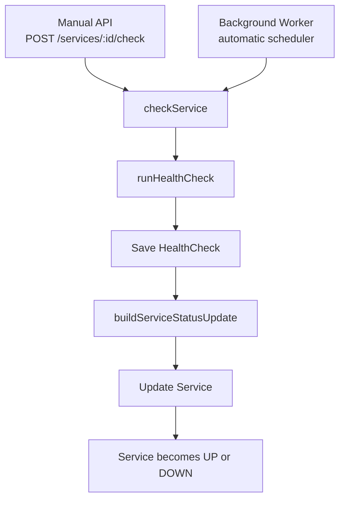
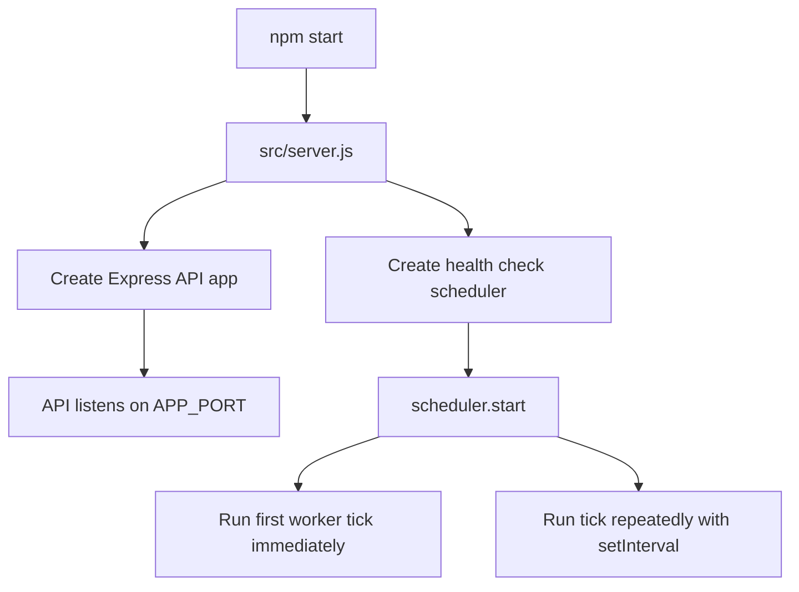
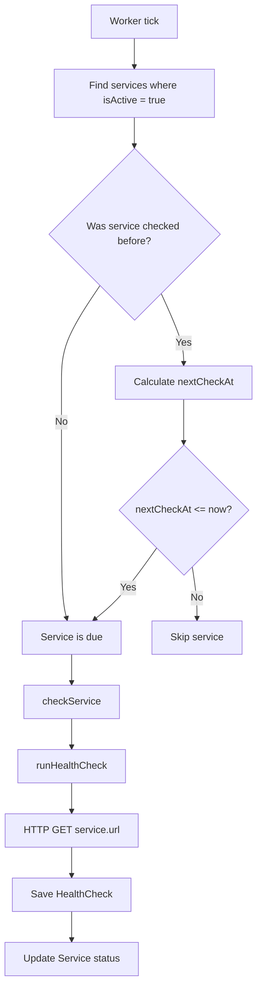
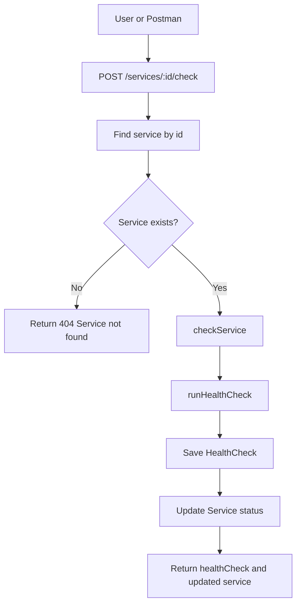
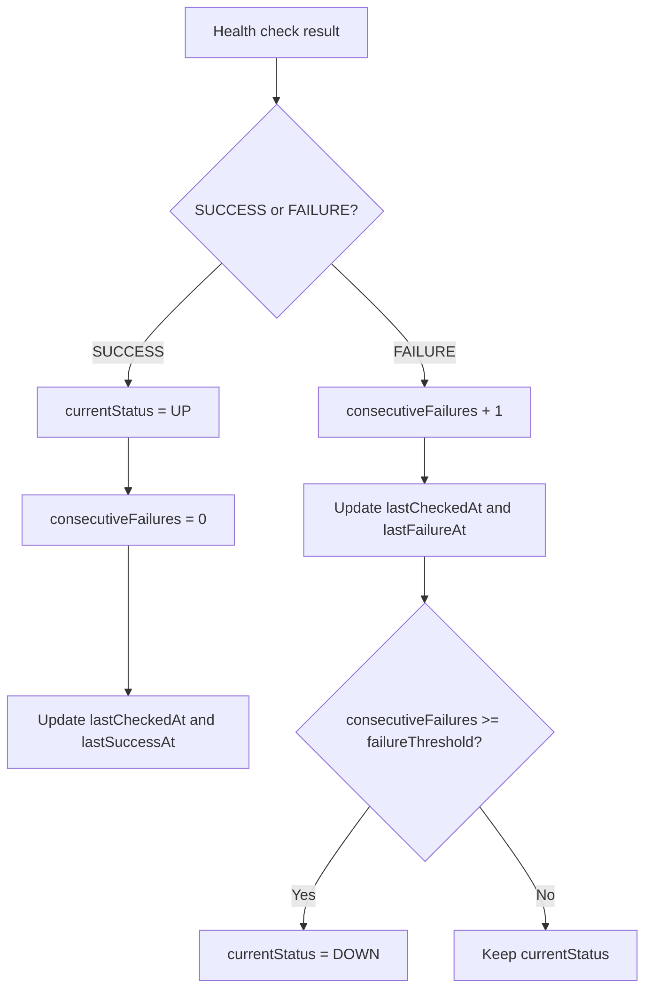

# Worker Workflow

This document explains how the HomeOps health check worker runs.

## Big Picture

HomeOps currently has two ways to run a health check:

1. A user manually calls `POST /services/:id/check`.
2. The background worker automatically checks active services.

Both flows use the same shared function: `checkService`.



## App Startup Flow

When the app starts, HomeOps starts both the API server and the worker.



Important files:

- `src/server.js`: starts the API and the scheduler.
- `src/app.js`: creates the Express app and stores the Prisma client.
- `src/workers/healthCheckScheduler.js`: contains the worker loop.

## Background Worker Flow

The worker checks all active services that are due for a new health check.



Due check rule:

```text
If lastCheckedAt is empty:
  check now

If lastCheckedAt + intervalSeconds <= now:
  check now

Otherwise:
  skip until later
```

## Manual Check Flow

Manual checks still exist. They are useful for testing and debugging.



## Service Status Update Flow

After every check, HomeOps updates the service status.



## Call Chain

Automatic worker flow:

```text
src/server.js
  -> scheduler.start()
  -> tick()
  -> runDueHealthChecks()
  -> prisma.service.findMany({ where: { isActive: true } })
  -> isServiceDueForCheck(service)
  -> checkService(prisma, service)
  -> runHealthCheck(service)
  -> prisma.healthCheck.create(...)
  -> buildServiceStatusUpdate(...)
  -> prisma.service.update(...)
```

Manual API flow:

```text
POST /services/:id/check
  -> src/routes/serviceRoutes.js
  -> findService(prisma, id)
  -> checkService(prisma, service)
  -> runHealthCheck(service)
  -> prisma.healthCheck.create(...)
  -> buildServiceStatusUpdate(...)
  -> prisma.service.update(...)
```

## Current Limitation

The current worker is intentionally simple:

- It runs inside the same Node.js process as the API.
- It checks due services sequentially.
- It does not use BullMQ yet.
- It does not create incidents yet.

This is enough for learning the basic worker concept. Later, HomeOps can move
to Redis and BullMQ when the project needs queue-based background jobs.
